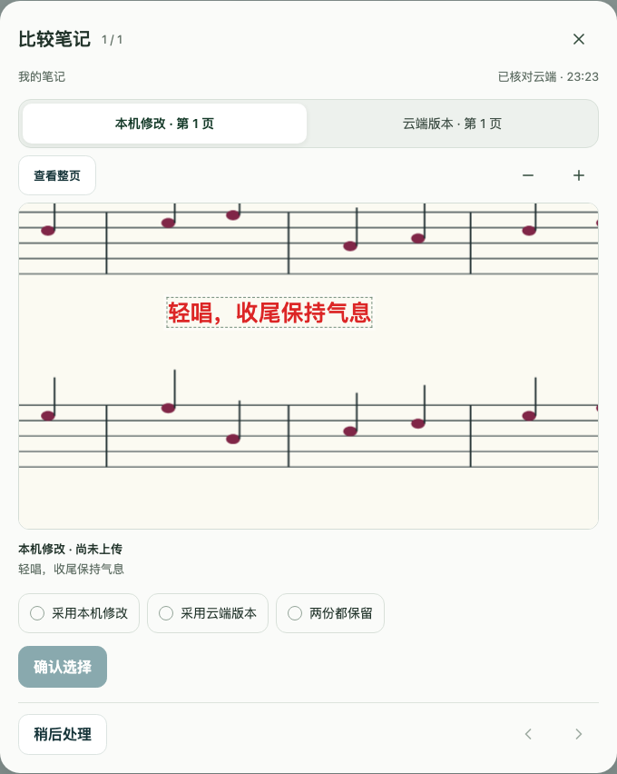
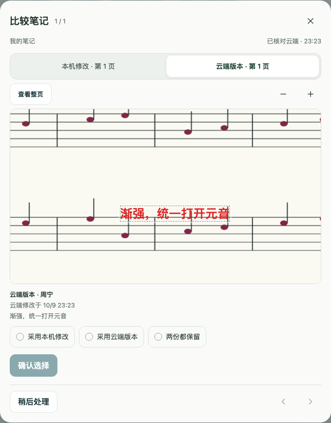
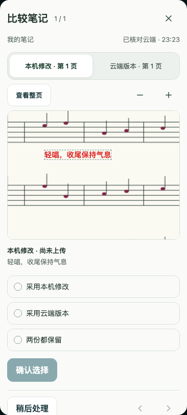

# 原位比较冲突笔记 · #395

手机、iPad 与桌面使用相同的「本机修改 / 云端版本」切换。在同一页切换时，原 PDF、缩放和视口保持不动；不同页明确标注双方页码。预览不会选择处理策略，用户明确选择后再确认具体后果。

本机修改：

云端版本：

手机：

这些截图来自实际 React 阅读器、PDF.js canvas 和 IndexedDB，使用仓库原创谱面、虚构身份与注入的冲突响应，没有生产内容。由 `visual-report/reader-conflicts.test.mjs` 捕获；不是设计稿。

浏览器回归覆盖 Chromium/WebKit 的手机与宽屏视口、同页切换不移动谱面、目标笔记实际可见、二次确认、本机继续编辑、Escape/返回与焦点恢复、最窄 320px、44px 操作与 200% 文本、删除、离线、画笔/荧光笔/形状、跨页和原页不存在。组件及存储回归保护陈旧确认、云端快照更新、失权保留和保存失败。确认后仍排队的修改显示等待或失权状态，保留重试同步入口；采用两份时以新增副本的接受状态为准。云端显示核对时间和笔记修改时间，离线明确核对时间未知。

不修改 API、笔记格式或数据库 schema。云端快照更新和处理继续使用现有 owner/session/scope 隔离与逐对象 OCC；删除前内容缺失时明确提示，不构造历史笔记。实机 iPad/PWA/Pencil 验收仍需另行执行。

本地最终验证（Node 24）：lint、typecheck、生产 build/预缓存检查通过；Node 规则 118/118、CI scope 20/20、完整客户端串行回归 103 个文件 940/940 通过。新冲突浏览器回归在两引擎、三视口通过；现有阅读器笔记稳定性/状态浏览器回归 3/3 通过。

此前完整客户端并行运行出现一项未修改的加载时序用例失败（`starts the confirmed cloud PDF when local verification stalls`）；reader/home 聚焦组 65/65 和完整串行运行均通过，未放宽断言或改变并行设置。Linux 并行与其它发布检查以 PR CI 为准。
